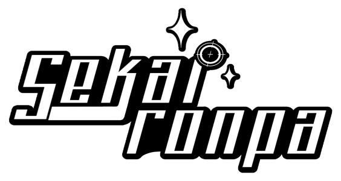

<!DOCTYPE html>
<html lang="en">
<head>
<title>Sekaironpa</title>
<link rel="preconnect" href="https://fonts.googleapis.com">
<link rel="preconnect" href="https://fonts.gstatic.com" crossorigin>
<link href="https://fonts.googleapis.com/css2?family=Pangolin&family=Roboto+Mono:wght@400;500;600;700&display=swap" rel="stylesheet"> 

<link rel="stylesheet" href="style.css">
  
  
</head>
<body>
  

    
  

Have you ever thought about how it would be to own the world? Just imagine, being gifted the unfathomable power to be able to do anything you'd want with little to no consequences. 
 
If you have thought about it, welcome to Sekaironpa! It's a crossover between Danganronpa and Project sekai where the power in question has been taken into action. 
 
In this fanmade project you'll watch as the beloved cast of Project Sekai gets thrown into a killing game. 
  
Who will be the first to get crushed under the detrimental weight of despair and who we be the one to lead everyone forward to an enchanting hope? 
 
Stay tuned our dear viewers for the premier of a once-in-a-lifetime attraction, a divine rebirth.
 
 
Hosted by yours truly, 
 
- Monomiku 

</body>
</html>
